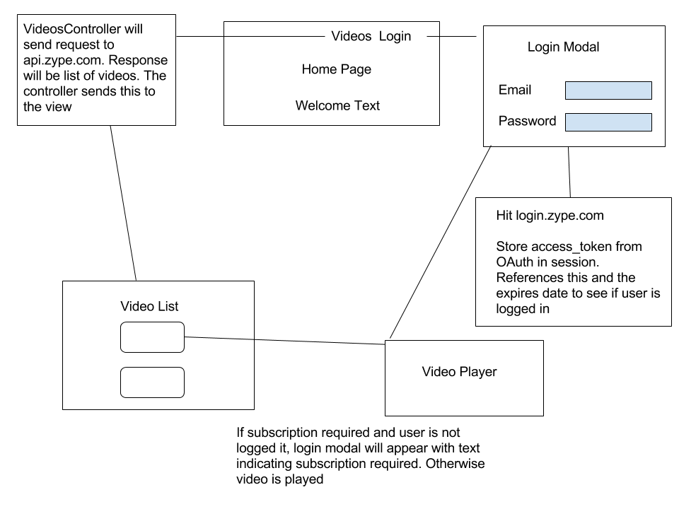

# High level architecture overview

## Main features
* Site will have two main features
  * Allow a user to login in order to view subscription vides
    * Devise and Oauth will handle user authentication. `User` model will be necessary here. Devise has built-in OAuth support, so I will use the Devise `initializer` to setup communication with Zype's login functionality.
  * Make calls to the Zype API and display those videos.
    * One option is to make a `Video` model and store the data from the API in that model. But I will opt to always make calls to the API instead of saving any of that info in my DB. That way I always have the latest info. This means that the `User` model is all I need in order to accomplish my two features. I will communicate with the Zype API via a `VideosController` as detailed below.

## Organization of code
* User model will be used to store user information. I will also use OAuth and hit Zype's login and use Devise to handle the user's sessions.
* I will use an `OAuthController` to handle the response from Zype's login. I'll look for an access token and if it is valid I can use Devise to log the user in. I can also set the expiration for the user session based on the `expires_in` value from the response and have Devise look at that as well when it authenticates a user. If it is expired, Devise can log the user out and ask for credentials again.
* Videos will be displayed with a `VideosController`. I'll use HTTParty so send requests to the API and get the videos. This will have both an `index` and `show` action.
  * for subscription vides, I'll first do a check to see if the user is logged in. If so, user has access to all videos. If not, I'll need to check each video for the subscription option.

## Diagram

## Tests
* Use rspec. Use Webmock to mock API calls
* Test login ability
  * handle correct credentials
  * handle incorrect credentials
* Test Videos
  * I get list of videos
  * show if subscription required and not logged in
  * show video if logged in
